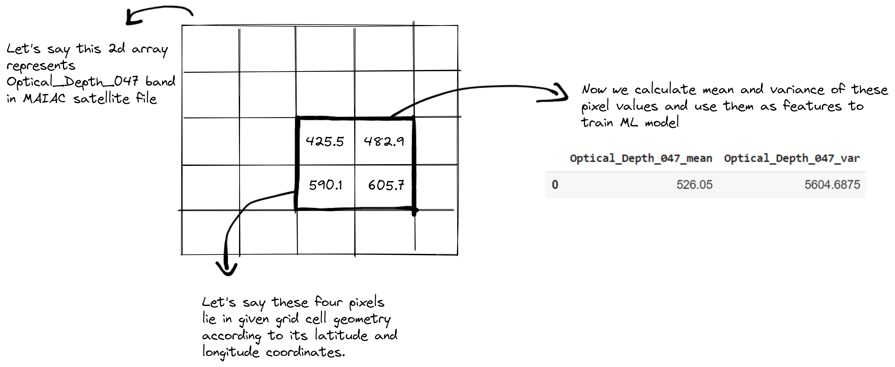
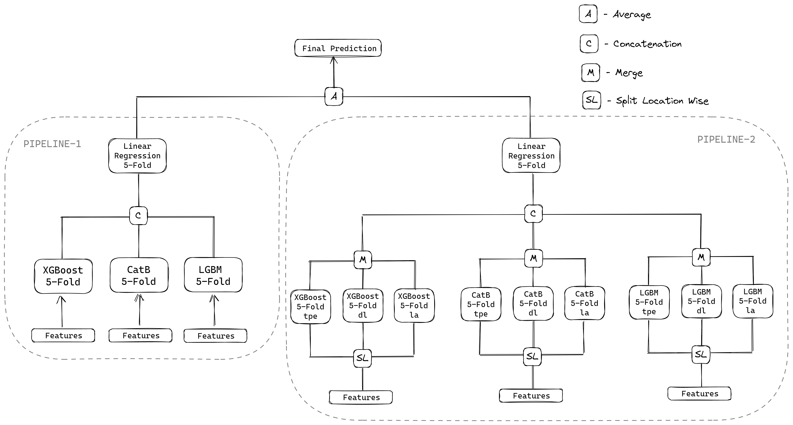

# NASA Airathon

Username: [vstark21](https://www.drivendata.org/users/vstark21/)

## Summary

* Firstly, for each data product, for each instance in train data and test data, we select the latest satellite file whose `satellite_time_end < observation_time_end` and then for each band in the file, we select pixels whose global coordinates lies in given grid cell polygon. You can find preprocessing notebooks for each data product in `notebooks/` directory.
  
  

* After collecting the features from all the data products (maiac, misr, gfs, nasadem) in the above mentioned way, we might find `nan` values in some feature columns in the dataframe. We perform *grid wise mean imputation*.
  
  ```python
  # Following code shows grid wise mean imputation
  # Here train_df, test_df contains collected features using above method
  # from all data products
  # train_metadata: train_labels.csv file
  
  feat_columns = [col for col in train_df.columns if col != 'grid_id']
  for grid_id in train_metadata['grid_id'].unique():
      for col in feat_columns:
          indices = train_df[train_df['grid_id'] == grid_id].index
          mean_val = train_df.loc[indices, col].mean()
          train_df.loc[indices, col] = train_df.loc[indices, col].fillna(mean_val)
          
          indices = test_df[test_df['grid_id'] == grid_id].index
          test_df.loc[indices, col] = test_df.loc[indices, col].fillna(mean_val)
  ```

* After performing imputation, we now create grid wise temporal diference features in the following way.
  
  ```python
  # Let's say today and yesterday contains features for predicting today's 
  # yesterday's concentration respectively. 
  # NOTE: today and yesterday must belong to same grid cell
  
  for col in feat_columns:
      today[col + '_temporal_diff'] = today[col] - yesterday[col]
  ```

* And then we create features from metadata which includes location, month, day and grid wise mean value.
  
  ```python
  # Grid wise mean value is calculated in following way
  # train_metadata: train_labels.csv file
  # test_metadata: submission_format.csv file
  train_df['mean_value'] = train_metadata['grid_id'].apply(
      lambda x: train_metadata[train_metadata['grid_id'] == x]['value'].mean()
  )
  test_df['mean_value'] = test_metadata['grid_id'].apply(
      lambda x: train_metadata[train_metadata['grid_id'] == x]['value'].mean()
  )
  ```

* After feature engineering we train entire pipeline.
  
  

## Repo structure

```bash
.
├── README.md 
├── assets
├── configs                   # Contains config files for training and inference
    ├── predict.yml
    ├── pipeline_0.yml
    ├── model_0.yml
    └── ...
├── data
    ├── backup                # Contains backup files
    ├── proc                  # Contains processed data
    ├── raw                   # Contains raw, unprocessed data
    ├── train_labels.csv
    ├── grid_metadata.csv
    └── ...
├── notebooks                 # Contains raw-data processing and EDA notebooks
├── src
    ├── data                  # Contains data pre-processing and feature engineering functions
    ├── models                # Contains modelling functions
    ├── inference             # Contains data downloading functions for inference
    ├── visualization         # Contains visualization functions
    └── utils                 # Contains utility functions
├── requirements.txt
├── predict.py                # Contains inference code for a single data point
├── train.py                  # Contains single model training code
├── train_locwise.py          # Contains location wise single model training code
├── train_pipeline.py         # Contains pipeline training code 
└── train_locwise_pipeline.py # Contains location wise pipeline training code
```

## Setup

Execute the following commands to create a conda environment *nasa_env* and then install all the dependencies.

```bash
conda create -n nasa_env python==3.9
pip install -r requirement.txt
conda install -c conda-forge rasterio
```

And now execute the following commands to download and unzip the trained weights. 

```bash
wget <github_url>
unzip models.zip
```

## Hardware

```
CPU: Intel(R) Core(TM) i5-8265U CPU @ 1.60GHz (8 CPUs)
GPU: No gpus were used in training
Memory: 8GB
OS: Windows 11 Home Single Language 64-bit
Train Duration: 26 mins (without including data pre-processing)
Inference Duration: Around 30 mins to predict one day’s concentrations for all the grids in three cities (Including data downloading and pre-processing)
```

## Run Training

As the final pipeline contains two pipes, we need to train two pipelines. As the training files use processed files, make sure `data/proc` directory has processed csv files.

```bash
python train_pipeline.py --config configs/pipeline_0.yml
python train_locwise_pipeline.py --config configs/pipeline_1.yml
```

## Run Inference

Run following command to run inference on a specific datetime and grid cell.

```bash
python predict.py --config "configs/predict.yml" --observation_start_time "2021-03-02T18:30:00Z" --grid_id "C7PGV" --satdata_file "data/pm25_satellite_metadata.csv" --ncar_email <username> --ncar_pswd <password>
```